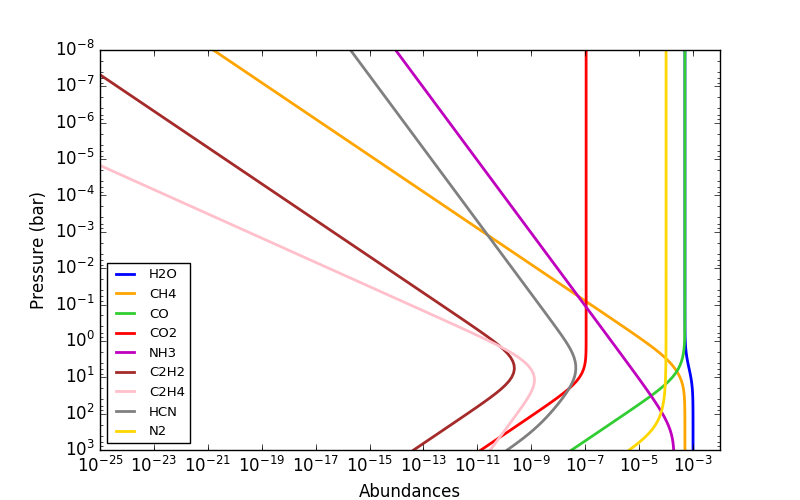
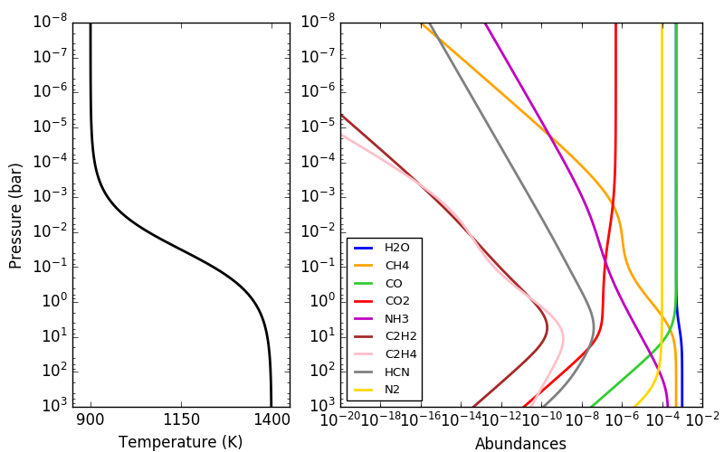

# rate
Reliable Analytic Thermochemical Equilibrium

This code computes thermochemical-equilibrium abundances for a H-C-N-O system with known pressure, temperature, and elemental abundances.  The output abundances are H2O, CH4, CO, CO2, NH3, C2H2, C2H4, HCN, and N2.

These calculations are valid over:
* pressures from 10<sup>-8</sup> to 10<sup>3</sup> bar,
* temperatures from 200 to 3000 K,
* C-N-O elemental abundances from 10<sup>-3</sup> to 10<sup>3</sup> times solar abundances,
* hydrogen-dominated systems (roughly, sum of metals less than 10%).

### Table of Contents
* [Team Members](#team-members)
* [Install](#install)
* [Getting Started](#getting-started)
* [Be Kind](#be-kind)
* [License](#license)

### Team Members
* [Patricio Cubillos](https://github.com/pcubillos/) (IWF) <patricio.cubillos@oeaw.ac.at>
* Jasmina Blecic (NYU Abu Dhabi)
* Ian Dobbs-Dixon (NYU Abu Dhabi)

### Install
``rate`` is compatible with both Python2 and Python3, and runs (at least) in both Linux and OSX.  
To obtain the ``rate`` code, clone this repository to your local machine with the following terminal commands:  
```shell
# Clone the repository to your working directory:  
git clone https://github.com/pcubillos/rate/
```

### Getting Started

The following Python script shows how to compute equilibrium abundances with ``rate``:

```python
import numpy as np
import matplotlib.pyplot as plt
# Make sure to have/add the path to the rate package in your pythonpath:
import rate

# Initialize object with solar composition:
r = rate.Rate(C=2.5e-4, N=1.0e-4, O=5.0e-4)

# Define atmospheric profile:
nlayers = 100
press = np.logspace(-8, 3, nlayers)  # bars
temp = np.tile(1400.0, nlayers)      # kelvin

# Compute abundances:
Q1 = r.solve(temp, press)

# See results:
label = "H2O", "CH4",  "CO",     "CO2", "NH3", "C2H2", "C2H4", "HCN", "N2"
col   = "b", "orange", "limegreen", "r", "m", "brown", "pink", "0.5", "gold"

plt.figure(-1, (8,5))
plt.clf()
for i in np.arange(len(Q1)):
  plt.loglog(Q1[i], press, lw=2, c=col[i], label=label[i])
plt.ylim(np.amax(press), np.amin(press))
plt.legend(loc="lower left", fontsize=9.5)
plt.xlim(1e-25, 1e-2)
plt.xlabel("Abundances")
plt.ylabel("Pressure (bar)")
```
<dl >
  
</dl>

```python
# A 'more interesting' temperature profile:
temp = 900+500/(1+np.exp(-(np.log10(press)+1.5)*1.5))
Q2 = r.solve(temp, press)

plt.figure(-2, (8,5))
plt.clf()
ax = plt.axes([0.1, 0.1, 0.3, 0.85])
plt.semilogy(temp, press, lw=2, color="k")
plt.ylim(np.amax(press), np.amin(press))
plt.xlim(850, 1450)
plt.ylabel("Pressure (bar)")
plt.xlabel("Temperature (K)")
ax = plt.axes([0.47, 0.1, 0.5, 0.85])
for i in np.arange(len(Q2)):
  plt.loglog(Q2[i], press, lw=2, c=col[i], label=label[i])
plt.ylim(np.amax(press), np.amin(press))
plt.xlim(1e-20, 1e-2)
plt.legend(loc="lower left", fontsize=9.5)
plt.xlabel("Abundances")
```
<dl >
  
</dl>

```python
# A carbon-dominated atmosphere, same temperature as before:
Q3 = r.solve(temp, press, C=1e-3)
plt.figure(-3, (8,5))
plt.clf()
for i in np.arange(len(Q3)):
  plt.loglog(Q3[i], press, lw=2, c=col[i], label=label[i])
plt.ylim(np.amax(press), np.amin(press))
plt.legend(loc="lower left", fontsize=9.5)
plt.xlim(1e-18, 1e-2)
plt.xlabel("Abundances")
plt.ylabel("Pressure (bar)")
```
<dl >
  
</dl>


### Be Kind

Please, be kind and acknowledge the effort of the authors by citing the article asociated to this project:  

  [Cubillos, Blecic, & Dobbs-Dixon (2018): Towards More Reliable Analytic Thermochemical-Equilibrium Abundances](http://adsabs.harvard.edu/abs/Doo-by-doo-by-doo), ApJ XX, YY.  


### License

Copyright (c) 2018 Patricio Cubillos and contributors.
``rate`` is open-source software under the MIT license (see LICENSE).

